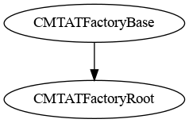
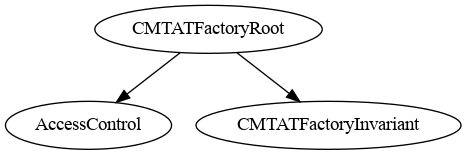
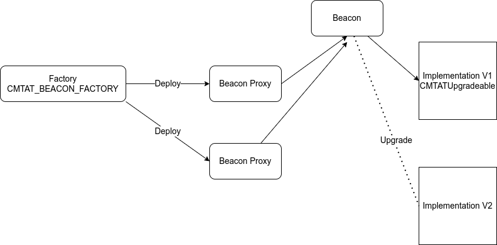
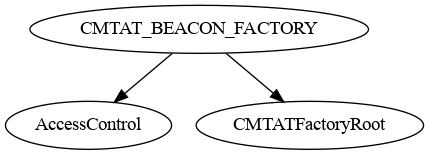
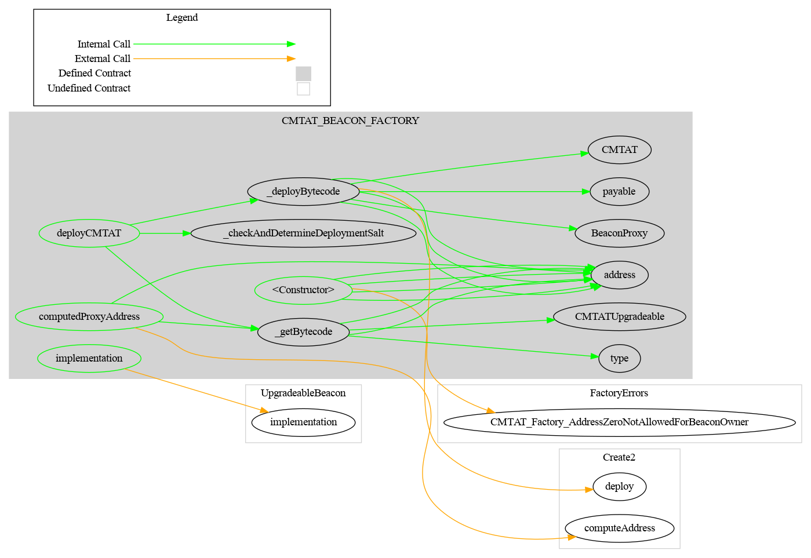
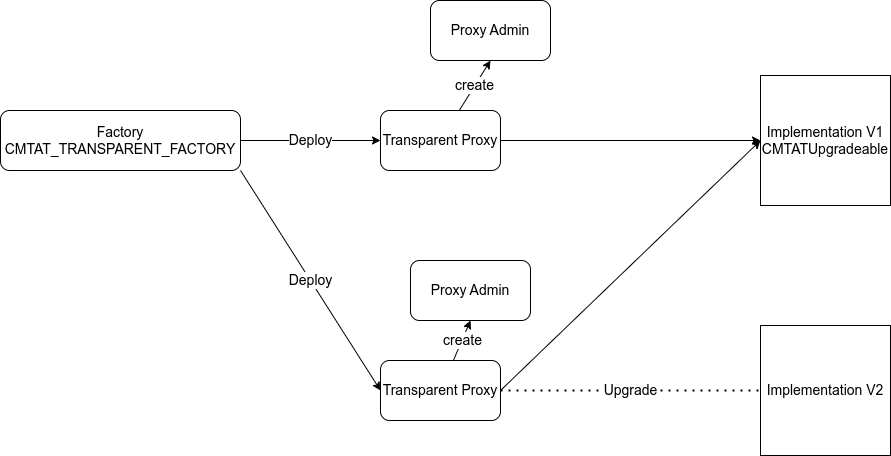
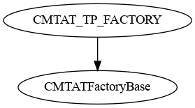
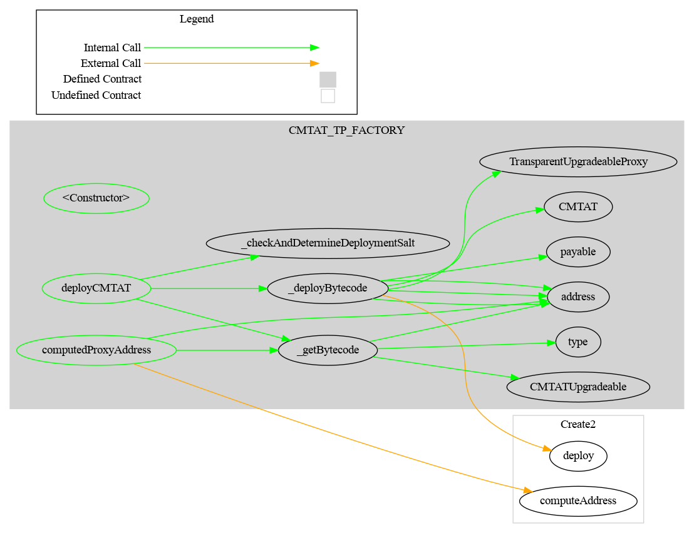
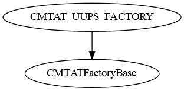
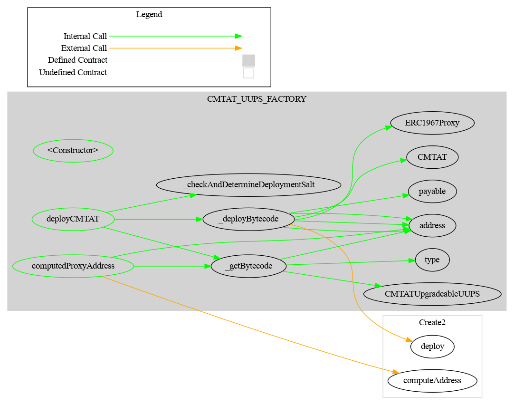

# CMTAT Factory

> This project is not audited
>
> If you want to use this project, perform your own verification or send an email to [admin@cmta.ch](mailto:admin@cmta.ch).

## Introduction

This project provides a modular deployment framework for [**CMTAT**](https://github.com/CMTA/CMTAT), a compliant token implementation, using three different upgradeability patterns: **UUPS proxy**, **Transparent proxy**, and **Beacon proxy**.
Each factory contract automates deployment using **deterministic addresses (via CREATE2)** and initializes CMTAT instances with a structured set of parameters passed in arguments by the deployer.

[TOC]

### Key features

- **Multiple proxy types** — choose UUPS, Transparent, or Beacon depending on your upgrade strategy.
- **Role-based security** — only authorized deployers can create new instances.
- **Predictable deployments** — computed addresses allow you to know the resulting contract address before deploying.
- **Self-contained factories** — each factory handles its own proxy administration logic.

### Factory Overview

- **UUPS Proxy Factory**
  - Deploys CMTAT behind a UUPS proxy ([ERC-1822](https://eips.ethereum.org/EIPS/eip-1822)) with minimal admin overhead.
  - Contract: [CMTAT_UUPS_FACTORY.sol](./contracts/CMTAT_UUPS_FACTORY.sol) 
- **Transparent Proxy Factory**
  - Deploys CMTAT behind a TransparentUpgradeableProxy with a dedicated ProxyAdmin contract.
  - Contract: [CMTAT_TRANSPARENT_FACTORY.sol](./contracts/CMTAT_TP_FACTORY.sol)
- **Beacon Proxy Factory**
  - Deploys CMTAT behind a BeaconProxy using an UpgradeableBeacon for shared implementation upgrades.
  - Contract: [CMTAT_BEACON_FACTORY.sol](./contracts/CMTAT_BEACON_FACTORY.sol)

## Library contracts

Library abstract contracts are imported by several different factories.

### CMTATFactoryBase




|       Contract       |       Type        |      Bases       |                |                  |
| :------------------: | :---------------: | :--------------: | :------------: | :--------------: |
|          └           | **Function Name** |  **Visibility**  | **Mutability** |  **Modifiers**   |
|                      |                   |                  |                |                  |
| **CMTATFactoryBase** |  Implementation   | CMTATFactoryRoot |                |                  |
|          └           |   <Constructor>   |     Public ❗️     |       🛑        | CMTATFactoryRoot |


### CMTATFactoryRoot




|       Contract       |               Type               |                Bases                 |                |               |
| :------------------: | :------------------------------: | :----------------------------------: | :------------: | :-----------: |
|          └           |        **Function Name**         |            **Visibility**            | **Mutability** | **Modifiers** |
|                      |                                  |                                      |                |               |
| **CMTATFactoryRoot** |          Implementation          | AccessControl, CMTATFactoryInvariant |                |               |
|          └           |          <Constructor>           |               Public ❗️               |       🛑        |      NO❗️      |
|          └           |        CMTATProxyAddress         |               Public ❗️               |                |      NO❗️      |
|          └           | _checkAndDetermineDeploymentSalt |              Internal 🔒              |       🛑        |               |


## Factory contracts

### Note

The struct `CMTAT_ARGUMENT` will be ABI encoded in function signature as: ` (address,(string,string,uint8),(string,(string,string,bytes32),string),(address,address,address))`.

```solidity
struct CMTAT_ARGUMENT {
    address CMTATAdmin;
    ICMTATConstructor.ERC20Attributes ERC20Attributes;
    ICMTATConstructor.ExtraInformationAttributes extraInformationAttributes;
    ICMTATConstructor.Engine engines;
}
```

**Details**

- ERC20Attributes

```
struct ERC20Attributes {
    string name;
    string symbol;
    uint8 decimalsIrrevocable;
}

=> (string,string,uint8)
```


- DocumentInfo

```
struct DocumentInfo {
    string name;
    string uri;
    bytes32 documentHash;
}
=> (string,string,bytes32)
```


- ICMTATConstructor.ExtraInformationAttributes

```
struct ExtraInformationAttributes {
    string tokenId;
    IERC1643CMTAT.DocumentInfo terms;
    string information;
}
=> (string,(string,string,bytes32),string)
```

- ICMTATConstructor.Engine

```
struct Engine {
    IRuleEngine ruleEngine;
    ISnapshotEngine snapshotEngine;
    IERC1643 documentEngine;
}
=> (address,address,address)
```


### Beacon Proxy Factory

A beacon proxy is very useful if you want to manage all your proxies in one place.

Unlike the transparent proxy, the beacon proxy does not point directly to the implementation contract. Instead, it stores the address of another contract called the *Beacon contract*. This contract is responsible for storing the address of the implementation. 

When an entity (EOA or contract) calls the proxy, the proxy then calls the beacon contract to retrieve the implementation and delegate the call to it.

For example:

1. The user (an EOA) calls the mintfunction on the proxy contract.
2. The proxy calls the beacon contract to get the address of the implementation.
3. The proxy calls the implementation contract with a delegateCall.

The factory will use the same beacon for each beacon proxy. 

- This beacon provides the address of the implementation contract, a CMTAT_PROXY contract. 
- If you upgrade the beacon to point to a new implementation, it will change the implementation contract for all beacon proxy.



#### Inheritance



#### Graph



#### Ethereum API

##### `deployCMTAT(bytes32, CMTAT_ARGUMENT) -> (BeaconProxy cmtat)`

Deploys a CMTAT token implementation behind a BeaconProxy.

**Parameters:**

| Name                | Type           | Description                                                  |
| ------------------- | -------------- | ------------------------------------------------------------ |
| deploymentSaltInput | bytes32        | Salt used for deterministic deployment (via CREATE2).        |
| cmtatArgument       | CMTAT_ARGUMENT | Struct containing initializer arguments for the CMTAT contract. |

**Return Values:**

| Name  | Type        | Description                                                  |
| ----- | ----------- | ------------------------------------------------------------ |
| cmtat | BeaconProxy | The deployed BeaconProxy instance pointing to the CMTAT implementation. |

------

##### `computedProxyAddress(bytes32, CMTAT_ARGUMENT) ->(address cmtatProxy)`

Get the predicted BeaconProxy address for a given deployment salt without deploying it.

**Parameters:**

| Name           | Type           | Description                                                  |
| -------------- | -------------- | ------------------------------------------------------------ |
| deploymentSalt | bytes32        | Salt used for deterministic deployment (via CREATE2).        |
| cmtatArgument  | CMTAT_ARGUMENT | Struct containing initializer arguments for the CMTAT contract. |

**Return Values:**

| Name       | Type    | Description                                                 |
| ---------- | ------- | ----------------------------------------------------------- |
| cmtatProxy | address | The computed address of the BeaconProxy for the given salt. |

------

#### `implementation() -> (address beaconImplementation)`

Get the current implementation address stored in the UpgradeableBeacon.

**Return Values:**

| Name                 | Type    | Description                                   |
| -------------------- | ------- | --------------------------------------------- |
| beaconImplementation | address | Address of the CMTAT implementation contract. |

### Transparent Proxy Factory

In the transparent proxy architecture, there are three contracts:

1. **Proxy admin contract**: controls and upgrades the proxy contract.
2. **Transparent proxy contract**: acts as the main entry point for the contract user.
3. **Implementation contract**: contains the code of your smart contract, in this case, the CMTAT. 

This architecture is more complex than a clone proxy because the proxy can be upgraded to point to a new implementation.

Moreover, the upgrade function is coded within the proxy itself, making the proxy larger to deploy than a UUPS proxy.

The factory will use the same implementation for each transparent proxy deployed. 

- Each transparent proxy has its owned proxy admin, deployed inside the constructor of the transparent proxy. 
- Each transparent proxy can upgrade their implementation to a new one independently and without impact on other proxies.



#### Inheritance

 

#### Graph



#### Ethereum API

##### `computedProxyAddress(bytes32,address, CMTAT_ARGUMENT) -> (address cmtatProxy)`

Get the predicted proxy address for a given deployment salt without deploying it.

**Parameters:**

| Name            | Type           | Description                                                  |
| --------------- | -------------- | ------------------------------------------------------------ |
| deploymentSalt  | bytes32        | Salt used for deterministic deployment (via CREATE2).        |
| proxyAdminOwner | address        | Address that will own the ProxyAdmin contract.               |
| cmtatArgument   | CMTAT_ARGUMENT | Struct containing initializer arguments for the CMTAT contract. |

**Return Values:**

| Name       | Type    | Description                                                 |
| ---------- | ------- | ----------------------------------------------------------- |
| cmtatProxy | address | The computed address of the CMTAT proxy for the given salt. |

------

##### `deployCMTAT(bytes32,address, CMTAT_ARGUMENT) -> (address proxy, address proxyAdmin)`

Deploys a CMTAT token implementation behind a TransparentUpgradeableProxy, along with a new ProxyAdmin contract.

**Parameters:**

| Name                | Type           | Description                                                  |
| ------------------- | -------------- | ------------------------------------------------------------ |
| deploymentSaltInput | bytes32        | Salt used for deterministic deployment (via CREATE2).        |
| proxyAdminOwner     | address        | Address that will own the ProxyAdmin contract.               |
| cmtatArgument       | CMTAT_ARGUMENT | Struct containing initializer arguments for the CMTAT contract. |

**Return Values:**

| Name  | Type    | Description                                          |
| ----- | ------- | ---------------------------------------------------- |
| proxy | address | Address of the deployed TransparentUpgradeableProxy. |

------

### UUPS ProxyFactory

Contrary to the Transparent Proxy, the logic to upgrade the proxy is situated in the implementation and not in the proxy, making the proxy cheaper to deploy. 

The factory will use the same implementation for each UUPS proxy deployed. 

- Each UUPS proxy can upgrade their implementation to a new one independently and without impact on other proxies.
- This is the reason whey there is a specific CMTAT contract which includes this logic to use: `CMTATUpgradeableUUPS`

#### Inheritance



#### Graph



#### Ethereum API

##### `deployCMTAT(bytes32, CMTAT_ARGUMENT) -> (ERC1967Proxy cmtat)`

Deploys a CMTAT token implementation behind a UUPS proxy using a deterministic salt.

**Parameters:**

| Name                | Type           | Description                                                  |
| ------------------- | -------------- | ------------------------------------------------------------ |
| deploymentSaltInput | bytes32        | Salt used for deterministic deployment (via CREATE2).        |
| cmtatArgument       | CMTAT_ARGUMENT | Struct containing initializer arguments for the CMTAT contract. |

**Return Values:**

| Name  | Type         | Description                                                  |
| ----- | ------------ | ------------------------------------------------------------ |
| cmtat | ERC1967Proxy | The deployed ERC1967Proxy instance pointing to the CMTAT implementation. |

------

##### `computedProxyAddress(bytes32, CMTAT_ARGUMENT) -> (address cmtatProxy)`

Get the predicted proxy address for a given deployment salt without deploying it.

**Parameters:**

| Name           | Type           | Description                                                  |
| -------------- | -------------- | ------------------------------------------------------------ |
| deploymentSalt | bytes32        | Salt used for deterministic deployment (via CREATE2).        |
| cmtatArgument  | CMTAT_ARGUMENT | Struct containing initializer arguments for the CMTAT contract. |

**Return Values:**

| Name       | Type    | Description                                                 |
| ---------- | ------- | ----------------------------------------------------------- |
| cmtatProxy | address | The computed address of the CMTAT proxy for the given salt. |


## Usage instructions

### Dependencies

The toolchain includes the following components, where the versions
are the latest ones that we tested: 

- npm 10.2.5
- Hardhat ^2.22.7
- Solidity [0.8.30](https://docs.soliditylang.org/en/v0.8.30/) (via solc-js)
- Node 20.5.0
- CMTAT [v3.0.0](https://github.com/CMTA/CMTAT/releases/tag/v3.0.0)
- OpenZeppelin Contracts (Node.js module) [v5.4.0](https://github.com/OpenZeppelin/openzeppelin-contracts/releases/tag/v5.2.0) 
- OpenZeppelin Contracts (Node.js module) [v5.4.0](https://github.com/OpenZeppelin/openzeppelin-contracts/releases/tag/v5.4.0) 
- OpenZeppelin Contracts Upgradeable (Node.js module) [v5.4.0](https://github.com/OpenZeppelin/openzeppelin-contracts-upgradeable/releases/tag/v5.4.0)


### Installation

- Clone the repository

Clone the git repository, with the option `--recurse-submodules` to fetch the submodules:

`git clone git@github.com:CMTA/CMTATFactory.git  --recurse-submodules`  

- Node.js version

We recommend to install the [Node Version Manager `nvm`](https://github.com/nvm-sh/nvm) to manage multiple versions of Node.js on your machine. You can then, for example, install the version 20.5.0 of Node.js with the following command: `nvm install 20.5.0`

The file [.nvmrc](../.nvmrc) at the root of the project set the Node.js version. `nvm use`will automatically use this version if no version is supplied on the command line.

- node modules

To install the node modules required by CMTAT, run the following command at the root of the project:

`npm install`

### Hardhat

> To use Hardhat, the recommended way is to use the version installed as
> part of the node modules, via the `npx` command:

`npx hardhat`

Alternatively, you can install Hardhat [globally](https://hardhat.org/hardhat-runner/docs/getting-started):

`npm install -g hardhat` 

See Hardhat's official [documentation](https://hardhat.org) for more information.

#### Contract size

You can get the size of the contract by running the following commands.

- Compile the contracts:

```bash
npx hardhat compile
```

- Run the script:

```bash
npm run-script size
```

The script calls the plugin [hardhat-contract-sizer](https://www.npmjs.com/package/hardhat-contract-sizer) with Hardhat.

#### Testing

Tests are written in JavaScript by using [web3js](https://web3js.readthedocs.io/en/v1.10.0/) and run **only** with Hardhat as follows:

`npx hardhat test`

To use the global hardhat install, use instead `hardhat test`.

Please see the Hardhat [documentation](https://hardhat.org/tutorial/testing-contracts) for more information about the writing and running of  Hardhat.


#### Code style guidelines

We use linters to ensure consistent coding style. If you contribute code, please run this following command: 

For JavaScript:

```bash
npm run-script lint:js 
npm run-script lint:js:fix 
```

For Solidity:

```bash
npm run-script lint:sol  
npm run-script lint:sol:fix
```

### Generate documentation

#### [Surya](https://github.com/ConsenSys/surya)

To generate documentation with surya, you can call the three bash scripts in [doc/script](./doc/script)

| Task                 | Script                      | Command exemple                                              |
| -------------------- | --------------------------- | ------------------------------------------------------------ |
| Generate graph       | script_surya_graph.sh       | npx surya graph -i contracts/**/*.sol <br />npx surya graph contracts/CMTAT_TP_FACTORY.sol |
| Generate inheritance | script_surya_inheritance.sh | npx surya inheritance contracts/modules/CMTAT_TP_FACTORY.sol -i <br />npx surya inheritance contracts/modules/CMTAT_TP_FACTORY.sol |
| Generate report      | script_surya_report.sh      | npx surya mdreport -i surya_report.md contracts/modules/CMTAT_TP_FACTORY.sol <br />npx surya mdreport surya_report.md contracts/modules/CMTAT_TP_FACTORY.sol |

In the report, the path for the different files are indicated in absolute. You have to remove the part which correspond to your local filesystem.


#### [Coverage](https://github.com/sc-forks/solidity-coverage/)

Code coverage for Solidity smart-contracts, installed as a hardhat plugin

```bash
npm run-script coverage
```


## Security

### Vulnerability disclosure

Please see [SECURITY.md](https://github.com/CMTA/CMTAT/blob/master/SECURITY.md) (CMTAT main repository).

### Audit

This project is not audited !

### Tools

#### [Slither](https://github.com/crytic/slither)

Slither is a Solidity static analysis framework written in Python3

```bash
slither .  --checklist --filter-paths "openzeppelin-contracts-upgradeable|openzeppelin-contracts|@openzeppelin|test|CMTAT" > slither-report.md
```


#### Aderyn

Here is the list of report performed with [Aderyn](https://github.com/Cyfrin/aderyn)

```bash
aderyn -x mock --output aderyn-report.md
```


## Further reading

For more details and test scenario, you can read this article on the Taurus blog: [Making CMTAT Tokenization More Scalable and Cost-Effective with Proxy and Factory Contracts](https://www.taurushq.com/blog/cmtat-tokenization-deployment-with-proxy-and-factory/).

This article uses the CMTAT version [2.5.1](https://github.com/CMTA/CMTAT/releases/tag/v2.5.1) when the factory code was still included in the CMTAT repository. The factory code corresponds to the Factory release: 0.1.0

## Intellectual property

The code is copyright (c) Capital Market and Technology Association, 2018-2025, and is released under [Mozilla Public License 2.0](./LICENSE.md).
